# Programar STM32F103CB a través del puerto USB.

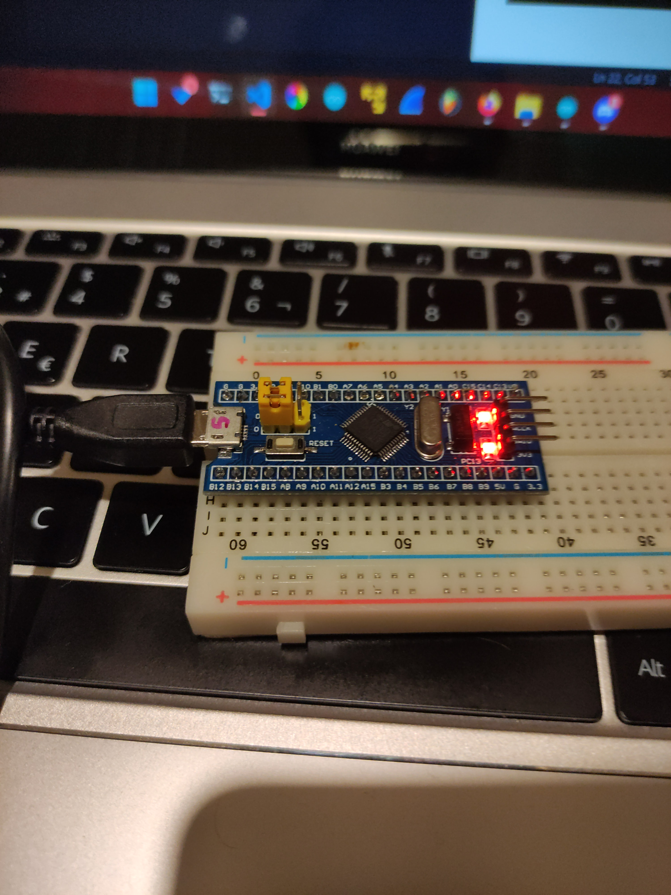

Esta guía está pensada para facilitar la programación del STM32 permitiéndonos usar el puerto microUSB integrado en vez de usar los conectores serial (GND, SWCLK, SWIO y 3V3), anteriormente **Windows 10** generaba menos problemas de compatibilidad con este tipo de placas, pero **Windows 11** nos vino a complicar las cosas, esta guía esta pensada para programar STM32 en **Windows 11**.

\
**Requerimentos:** 
- STM32F103CB
- Programador serial, basta con que tenga las conexiones RX, TX, GND y 5V
- Cable microUSB a USB A
- Conexión a internet

\
**El diagrama de conección se muestra a continuación:**

Para programar el STM32 deberemos de colocar el BOOT0 jumper de la posición 0 a la 1 (Programming mode)

Boot 1 (Programming mode)

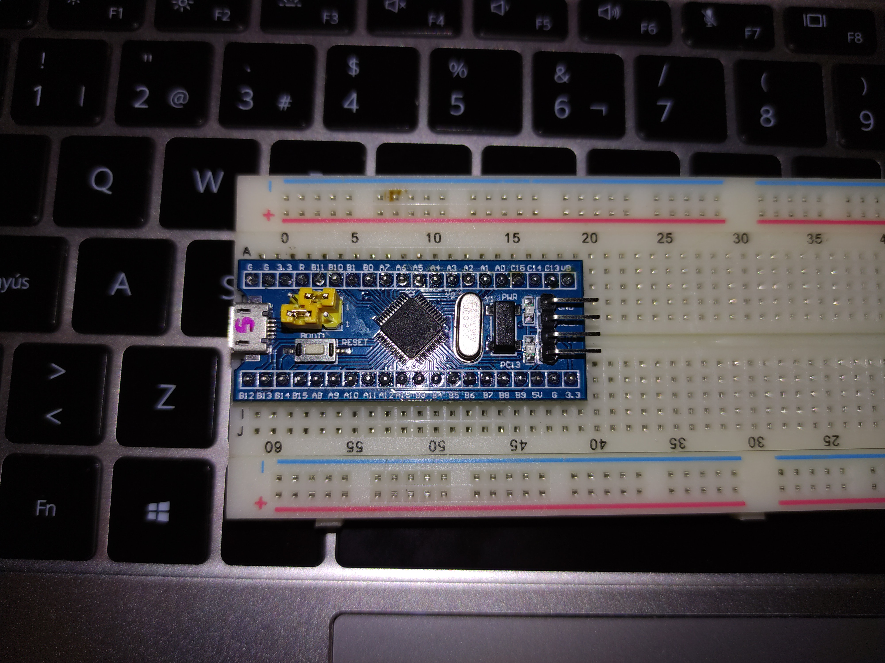

\
Conectaremos el programador serial al puerto USB de nuestra computadora.

\
Nuestra computadora no será capaz de reconocer el dispositivo debido a un problema de driver "PL2303HXA PHASED OUT SINCE 2012 PLEASE CONTACT YOUR SUPPLIER".

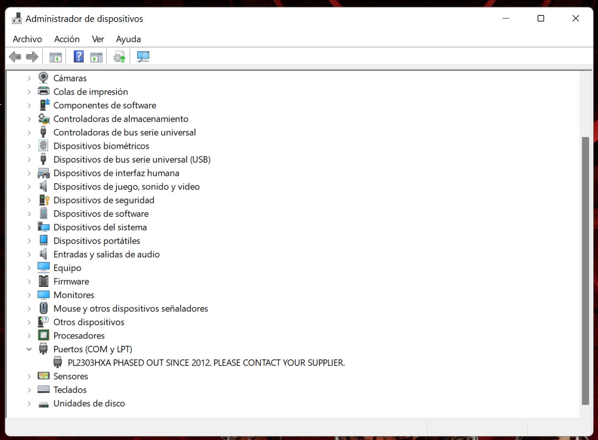

Actualizaremos nuestro driver seleccionando que ya viene incluido en la carpeta "Prolific PL2303 driver" seleccionando la opción de buscar drivers en nuestro equipo y voilá, ha quedado solucionado, ahora ya es reconocible.

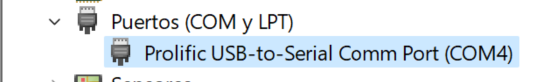

\
Ejecutaremos esta aplicación contenida en la carpeta y la instalaremos.

\
Una vez abierta procedemos.

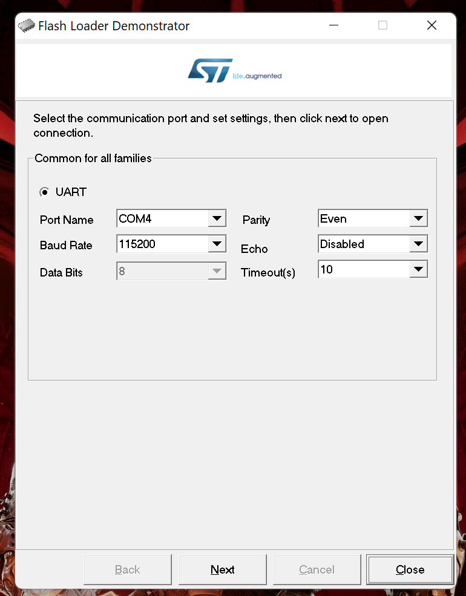

\
Continuamos

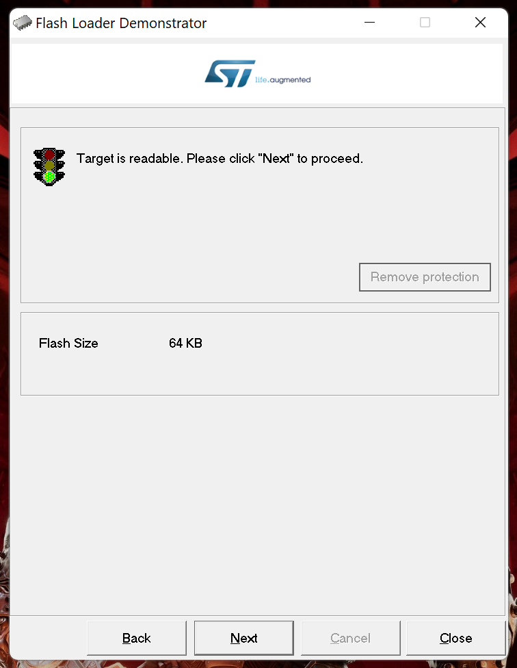

\
El target será identificado automáticamente, no tocaremos nada y continuamos

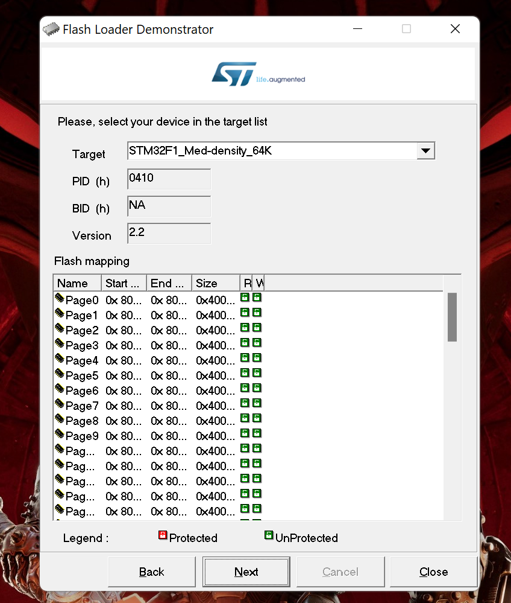

\
Seleccionamos "Download to device" y escogemos el archivo binario necesario para nuestra placa "generic_boot20_pc13.bin".

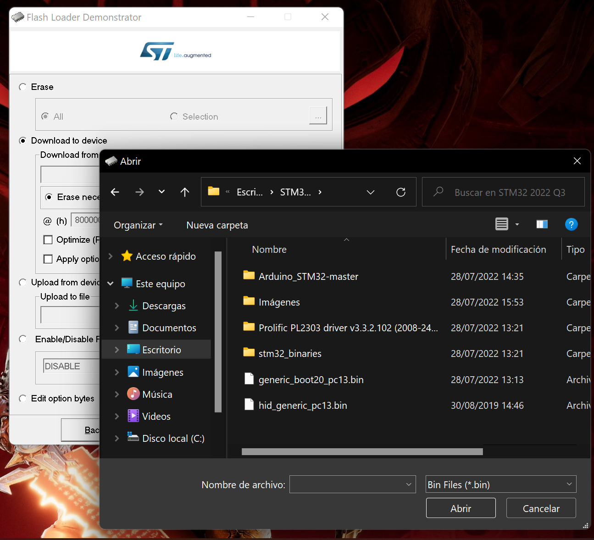

\
Finalizamos y cerramos

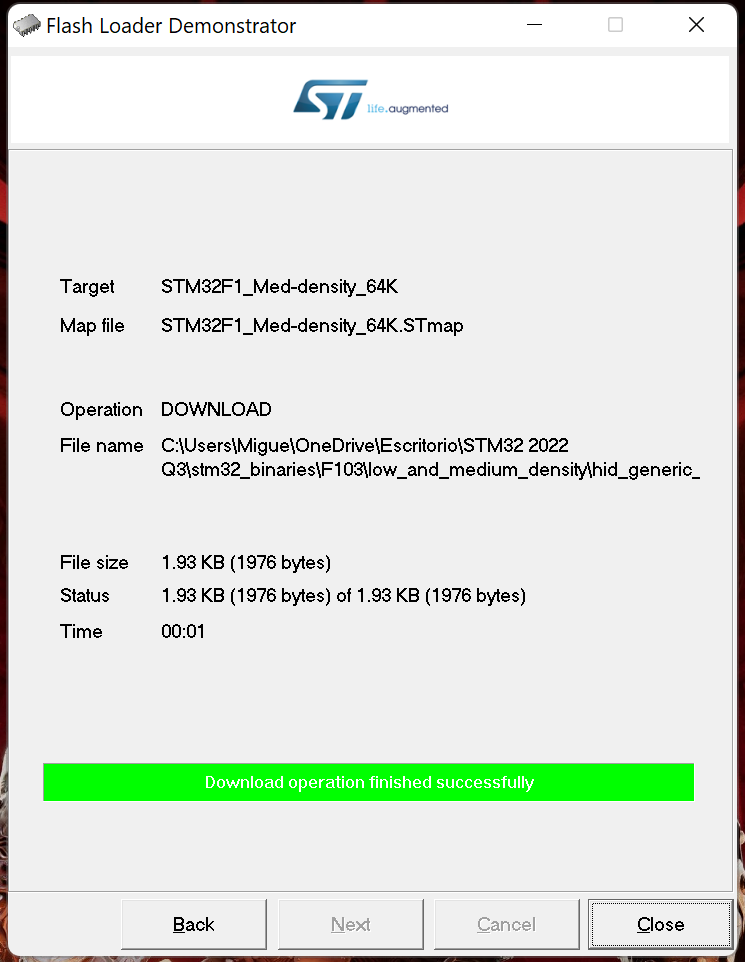

\
Sin desconectar su energía pasaremos nuevamente el jumper a la posición 0, para este paso ya estará flasheado nuestro stm32 y podrá ser usado mediante el puerto microUSB

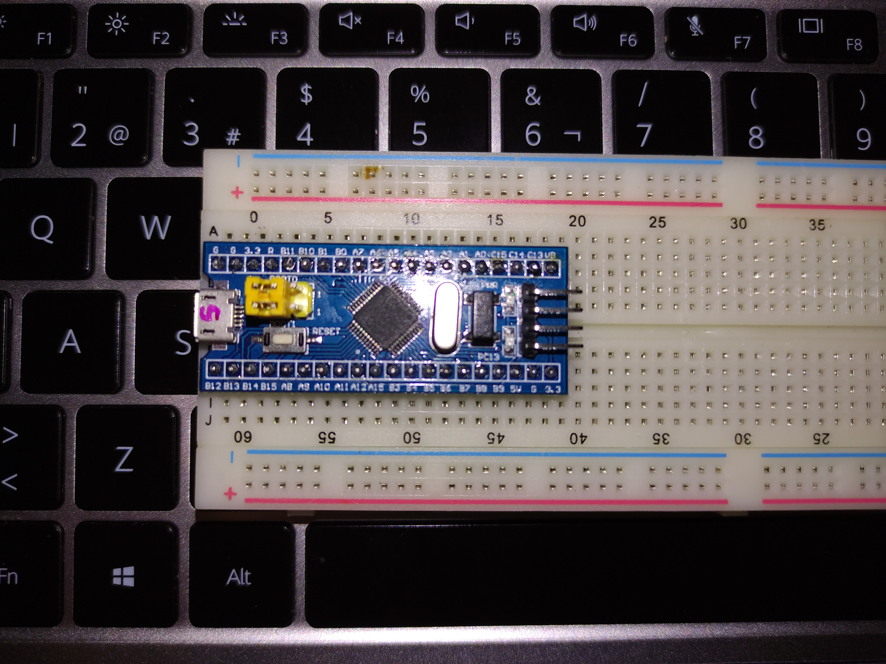

\
Ahora si podemos desconectarlo de la energía y usar el microUSB.

\
.
### Arduino IDE Setup
En las preferencias del IDE, pegaremos esta liga http://dan.drown.org/stm32duino/package_STM32duino_index.json y seleccionaremos OK, iremos al administrador de placas donde buscaremos “STM32F1” e instalaremos.

Y de la carpeta descargada de https://github.com/rogerclarkmelbourne/Arduino_STM32 Buscaremos en la ruta Arduino_STM32-master\drivers\win e instalaremos install_drivers.bat y install_STM_COM_drivers.bat.

\
Dentro del IDE de Arduino, nuestras configuraciones serán las siguientes:

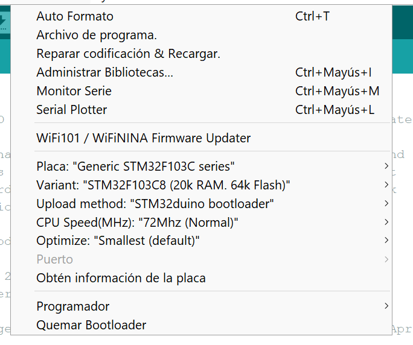

El puerto dependerá de cada uno de nosotros

## Eso ha sido todo, a programar!!